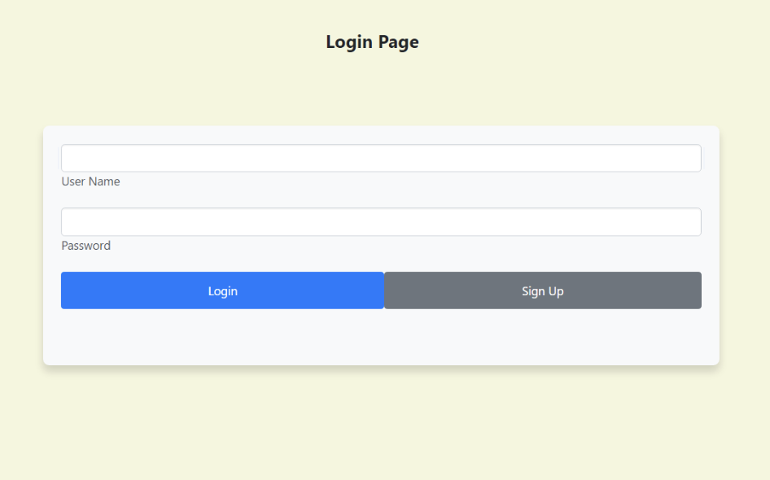
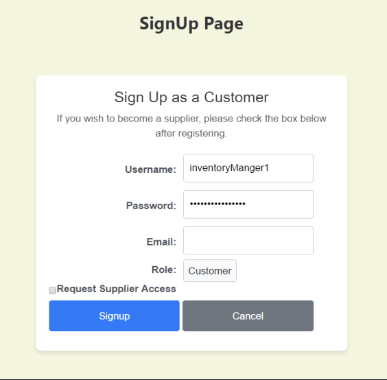
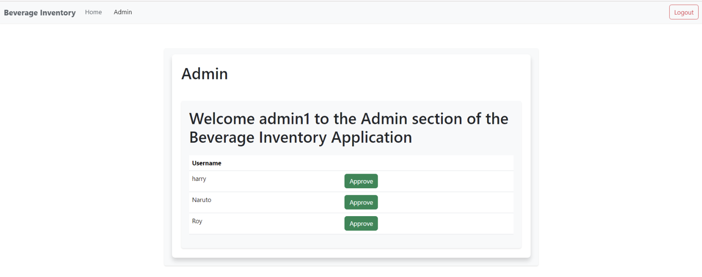
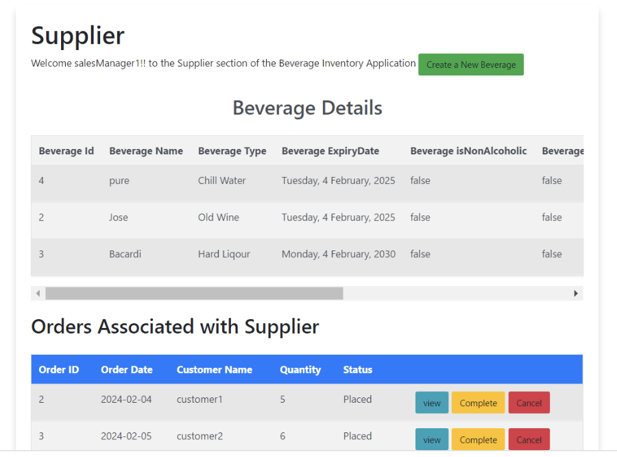
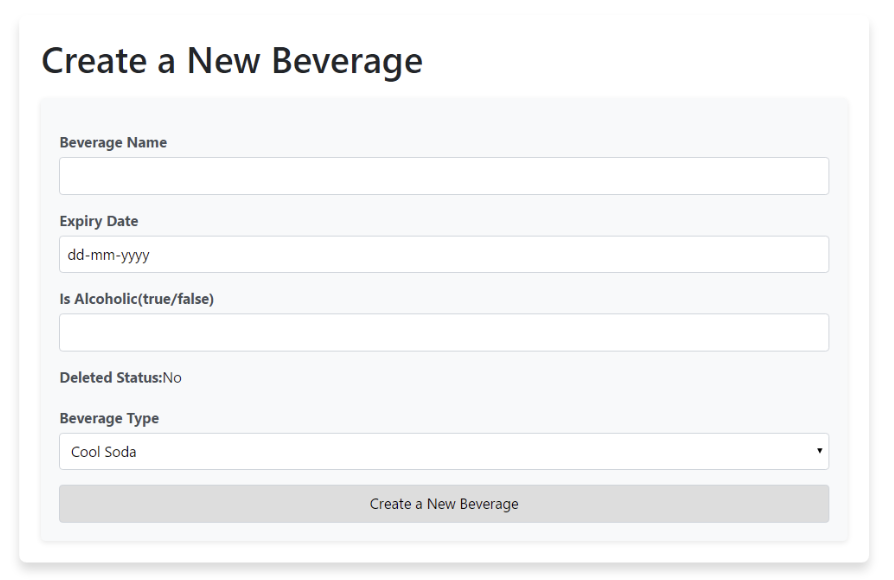
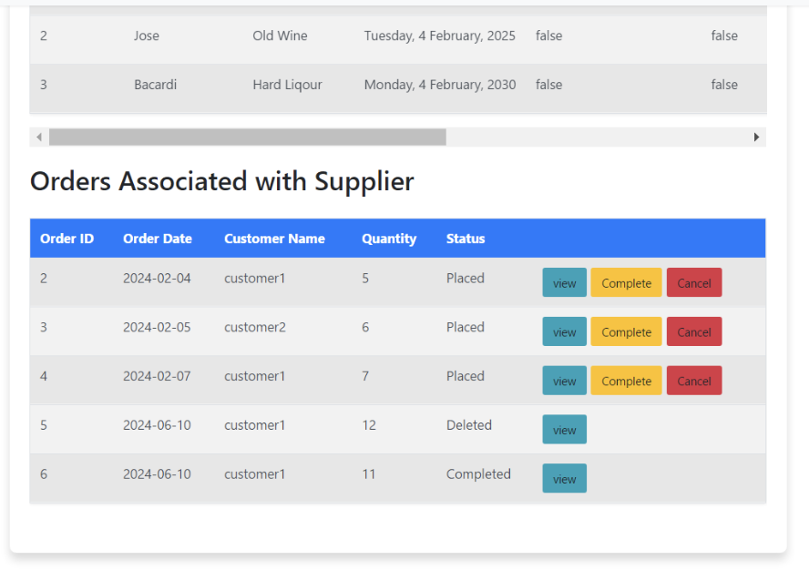
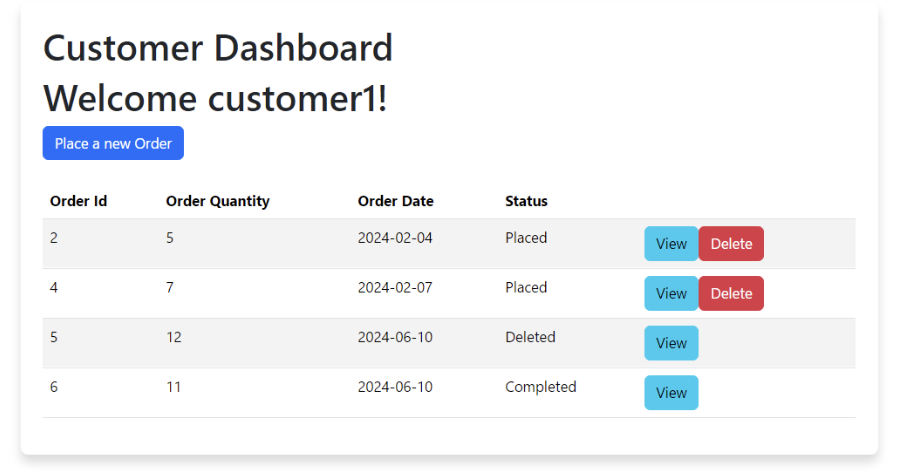
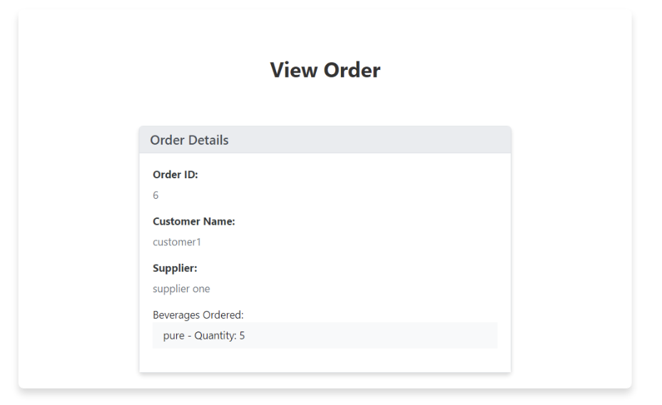

# Quick Read- AI Book Summary Android App – UI Overview  

This application is designed to search, explore, and save books while generating **AI-powered summaries** using **Gemini AI API**.

Built with **Java**, **Andriod Studios**, **Google Books API**, **Firebase Authentication & Realtime Database**, **Gemini AI API**, and **Material Design**.

Below is a walkthrough of the key UI pages and their functionalities.  

---

## Login Page  
  

- Allows users to **log in** with a username and password.  
- Provides options to **sign up for a new account**.  
- Implements **role-based authentication** for Admin, Supplier, and Customer.  

---

## Sign Up Page  
  

- Users can **register as a Customer** by default.  
- Option to **request supplier access** during registration.  
- Captures **username, password, email, and role** details.  

---

## Admin Portal  
  

- Admin can **review and approve supplier access requests**.  
- Displays a list of pending requests with an **Approve button**.  
- Ensures only authorized users are upgraded to **Supplier role**.  

---

## Supplier Dashboard  
  

- Supplier users see a **welcome page with navigation bar** for quick access.  
- Can view their **inventory of beverages** and manage details.  
- Provides options to **create, edit, or update beverages** with expiry and type info.  

---

## Create Beverage Form  
  

- Enables Suppliers to **add new beverages** to the system.  
- Input fields: **Beverage Name, Expiry Date, Alcoholic/Non-Alcoholic flag, Status, Beverage Type**.  
- Ensures proper and validated beverage data entry.  

---

## Supplier Orders View  
  

- Suppliers can track **orders placed by customers** for their beverages.  
- Each order includes: **Order ID, Date, Customer, Quantity, and Status**.  
- Status updates include: **Placed, Completed, Cancelled, Deleted**.  

---

## Customer Dashboard  
  

- Customers view their **personal dashboard** showing all orders.  
- Options to **place new orders, view order details, and delete/cancel orders**.  
- Displays order **status history** for better tracking.  

---

## View Order Page  
  

- Shows **full order details**: Order ID, Customer Name, Supplier, and Beverages Ordered.  
- Provides a quick transaction summary for Customers and Suppliers.  

---

# Key Features  

- **Role-based access** for Admin, Supplier, and Customer.  
- **Inventory management** for Suppliers to add and manage beverages.  
- **Order lifecycle handling**: Customer places order → Supplier manages order → Admin approves suppliers.  
- **Dynamic dashboards** for each role.  
- **Secure authentication** with login, signup, and role-based permissions.  

---
